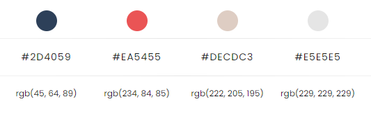
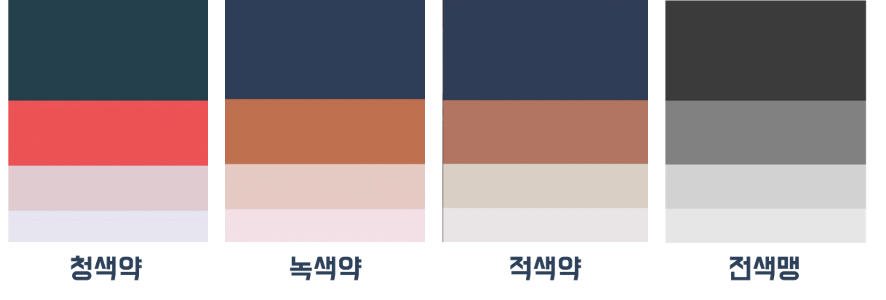

# 프로젝트 고려 사항

## **1. 대표 색**

 

 
- 색약, 색맹이신 분들도 구분할 수 있는 색으로 조합  

## **2. 아이콘**

 

- 색 뿐만 아니라 빗금, 체크 표시로 선택 유무를 구분

## **3. TTS**

사진마다 alt 값을 추가해서 저시력 사용자가 이용할 수 있는 TTS 기능 구현

## **4. Font**

유니버설디자인 서체를 적용하여 고령층과 저시력인까지 읽기 편안한 서비스를 제공
